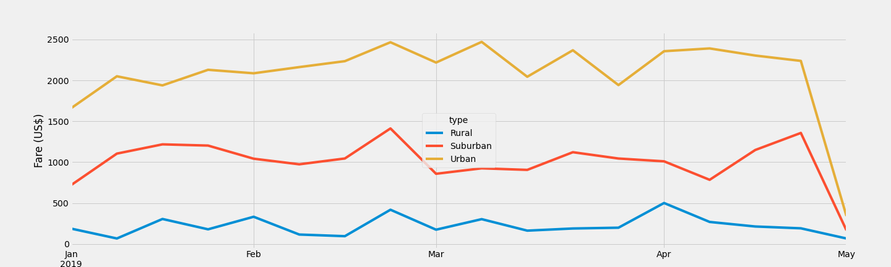

# PyBer_Analysis
## Overview 
This analysis is to help a ride-sharing app to improve its access using Matplotlib, Pandas based on different types of cities, the number of the driver, the total fare etc. Moreover, to determine the price affordability of the customers and guide the decision-maker of PyBer.

## Results

TThroughout the period, urban stands the highest fare, ranging between $400 to $ 2500. And the rural stand the lowest fare. The overall price dramatically decreased to under $500 in May. However, three cities reach their peak points in April. The fare of the urban city shows the most fluctuate trend in the first quarter. 

Based on the above box plot chart, the urban city has the maximum rides at 39, and the rural has the minimum rides at 3. This indicates that the ride count is influent by the size of the city; as the city size increase, the ride increase. 

## Summary-recommendations
1. Arrange for drivers to work in which cities they go to most often
2. Set different fares in the urban, for example, the price could be higher in the worktime, and on the weekend, the price could be lower.
3. Give rural drivers more subsidies and rest time to attract more people to work in rural areas
